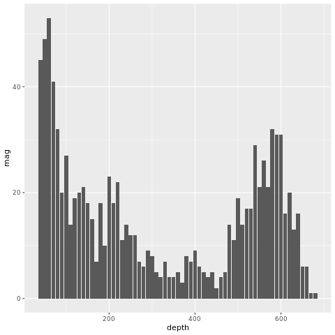

# Table of Contents
* [Introduction](#introduction)
* [Installation](#installation)
* [The Test](#the-test)
* [License](#license)
* [Troubleshooting](#troubleshooting)

# Introduction
This program is named `plotter`. If the name doesn't give it away, `plotter` plots things! More specifically, `plotter` is a simple test program to see if a personalized module, a singularity container, and File I/O work on the RHEL7 nodes. I designed plotter to be similiar to a typical workflow that I help users with.

The user comes to me with a need. Usually that need is that they need software installed locally or in their group directory. I follow the RHEL standard where if it's possible to containerize a process, then you should. Therefore, I build a singularity container! This way the installation is the same for everyone in the group, and I can use either `apt` or `yum` to install the core dependencies that I need.

The problem though is that the commands you use to interact with singularity containers can be quite long and are quite error prone. Here's an example:

```
$ singularity -s exec my_container.sif R --version
```

All that just to print out the R version! In the eyes of HCD this is unacceptable. Users are used to loading modules, not having to learn a whole new method in order to interact with software on the cluster. Therefore, I create a module that users can load! Now we are back in the land of the familiar, and users can again focus on their research rather than learning the ins and outs of the Linux command line.

# Installation
To correctly setup this repository for testing I created a simple shell script that will take care of everything for you. Simply use the following commands to download and set up the test environment:

```bash
$ git clone https://github.com/NucciTheBoss/r_container_test_aci.git
$ cd r_container_test_aci
$ bash setup.sh
```

This setup script will download the relevant singularity container and copy the module file to `${HOME}/work/sw/modules/r_rstudio`. To use the module simply use the following commands:

```bash
$ module use ${HOME}/work/sw/modules
$ module load r_rstudio/test
```

# The Test

  * [Launching RStudio](#launching-rstudio)
  * [Submitting a batch job](#submitting-a-batch-job)
  * [Installing a new package](#installing-a-new-package)

## Launching RStudio
My R containers usually come packaged with RStudio Desktop. This is to provide users with their own custom development environment. Therefore, the first step is to open RStudio. This should be done in the terminal of an interactive desktop launched through Open Ondemand:

```bash
$ module use ${HOME}/work/sw/modules
$ module load r_rstudio/test
$ rstudio
```

The RStudio GUI should open with no problem, and you should be able to start writing your R code!

## Submitting a batch job
Now that we have written our code we want to run in RStudio, it is time to submit it as a batch job to the cluster. The pbs file is already stored in the git repo, so all you have to is change into the directory and use `qsub` to submit the job:

```bash
$ cd r_container_test_aci
$ qsub plotter.pbs
```

The job should take no more than 10 minutes to complete. This job's purpose is to generate some graphs that are important to your research. The R script `plotter.R` will create the graphs and save them as `.png` files. The job script will then go in and create a zip archive that you can download to your local machine and analyze your data. To view the data on the cluster simply use the `unzip` command.

If the job is successful, you should be able to find the zip file `my_graphs.zip` in your scratch directory. The `zip` archive should contain six different graphs. Your output should look like the following:

* [fancy_graph_1](#fancy_graph_1)
* [fancy_graph_2](#fancy_graph_2)
* [huron_type_b](#huron_type_b)
* [huron_type_l](#huron_type_l)
* [huron_type_p](#huron_type_p)
* [longley_xyplot](#longley_xyplot)

#### fancy_graph_1


#### fancy_graph_2


#### huron_type_b


#### huron_type_l


#### huron_type_p


#### longley_xyplot


If your graphs look something like the above then the test was a success!

## Installing a new package
Let's say that I want to add a new R package to my container, but I don't necessarily want to rebuild it. R is neat because it lets you store R packages in external libraries rather than installing it alongside the root installation. Since R has that capability, we are going to install the R package `charlatan` in an external library outside of the container. Use the following commands to do this:

```bash
$ module use ${HOME}/work/sw/modules
$ module load r_rstudio/test
$ R
> install.packages("charlatan")
```

You should be able to successfully install `charlatan`. Test using the following command:

```bash
$ Rscript -e "library(charlatan)"
```

# License
This repository is licensed under the GNU General Public License v3.0. For more information on what this license entails, please feel free to visit https://www.gnu.org/licenses/gpl-3.0.en.html

# Troubleshooting
If you encounter any issues with the code in this repository while testing the RHEL7 nodes then please contact Jason at either jcn23@psu.edu or at iask@ics.psu.edu